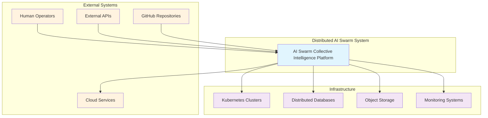
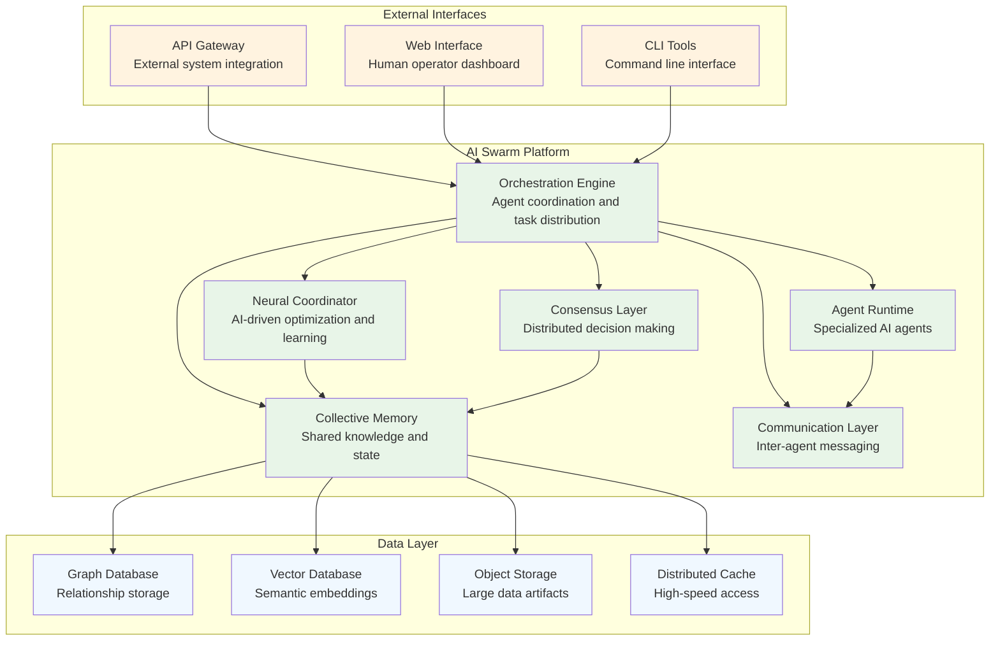
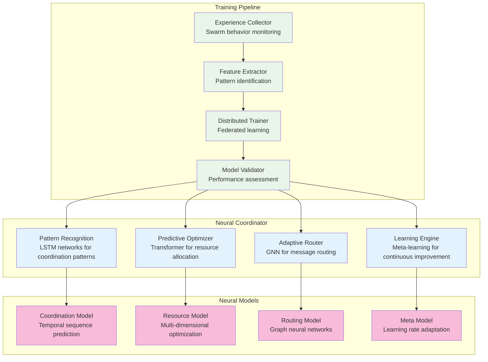

# C4 Model - System Context Diagram

## System Context

```mermaid
graph TB
    subgraph "External Systems"
        USER[Human Operators]
        API[External APIs]
        GITHUB[GitHub Repositories]
        CLOUD[Cloud Services]
    end

    subgraph "Distributed AI Swarm System"
        SWARM[AI Swarm Collective Intelligence Platform]
    end

    subgraph "Infrastructure"
        K8S[Kubernetes Clusters]
        DB[Distributed Databases]
        STORAGE[Object Storage]
        MONITOR[Monitoring Systems]
    end

    USER --> SWARM
    API --> SWARM
    GITHUB --> SWARM
    SWARM --> CLOUD
    
    SWARM --> K8S
    SWARM --> DB
    SWARM --> STORAGE
    SWARM --> MONITOR

    classDef systemBox fill:#e1f5fe
    classDef externalBox fill:#fff3e0
    classDef infraBox fill:#f3e5f5

    class SWARM systemBox
    class USER,API,GITHUB,CLOUD externalBox
    class K8S,DB,STORAGE,MONITOR infraBox
```

## Container Diagram

```mermaid
graph TB
    subgraph "AI Swarm Platform"
        ORCHESTRATOR[Orchestration Engine<br/>Agent coordination and task distribution]
        NEURAL[Neural Coordinator<br/>AI-driven optimization and learning]
        CONSENSUS[Consensus Layer<br/>Distributed decision making]
        MEMORY[Collective Memory<br/>Shared knowledge and state]
        AGENTS[Agent Runtime<br/>Specialized AI agents]
        COMMUNICATION[Communication Layer<br/>Inter-agent messaging]
    end

    subgraph "External Interfaces"
        API_GW[API Gateway<br/>External system integration]
        WEB_UI[Web Interface<br/>Human operator dashboard]
        CLI[CLI Tools<br/>Command line interface]
    end

    subgraph "Data Layer"
        GRAPH_DB[Graph Database<br/>Relationship storage]
        VECTOR_DB[Vector Database<br/>Semantic embeddings]
        OBJECT_STORE[Object Storage<br/>Large data artifacts]
        CACHE[Distributed Cache<br/>High-speed access]
    end

    API_GW --> ORCHESTRATOR
    WEB_UI --> ORCHESTRATOR
    CLI --> ORCHESTRATOR

    ORCHESTRATOR --> NEURAL
    ORCHESTRATOR --> CONSENSUS
    ORCHESTRATOR --> MEMORY
    ORCHESTRATOR --> AGENTS
    ORCHESTRATOR --> COMMUNICATION

    NEURAL --> MEMORY
    CONSENSUS --> MEMORY
    AGENTS --> COMMUNICATION
    MEMORY --> GRAPH_DB
    MEMORY --> VECTOR_DB
    MEMORY --> OBJECT_STORE
    MEMORY --> CACHE

    classDef containerBox fill:#e8f5e8
    classDef interfaceBox fill:#fff3e0
    classDef dataBox fill:#f0f8ff

    class ORCHESTRATOR,NEURAL,CONSENSUS,MEMORY,AGENTS,COMMUNICATION containerBox
    class API_GW,WEB_UI,CLI interfaceBox
    class GRAPH_DB,VECTOR_DB,OBJECT_STORE,CACHE dataBox
```

## Component Diagram - Neural Coordination Layer

```mermaid
graph TB
    subgraph "Neural Coordinator"
        PATTERN[Pattern Recognition<br/>LSTM networks for coordination patterns]
        OPTIMIZER[Predictive Optimizer<br/>Transformer for resource allocation]
        ROUTER[Adaptive Router<br/>GNN for message routing]
        LEARNER[Learning Engine<br/>Meta-learning for continuous improvement]
    end

    subgraph "Neural Models"
        COORD_MODEL[Coordination Model<br/>Temporal sequence prediction]
        RESOURCE_MODEL[Resource Model<br/>Multi-dimensional optimization]
        ROUTING_MODEL[Routing Model<br/>Graph neural networks]
        META_MODEL[Meta Model<br/>Learning rate adaptation]
    end

    subgraph "Training Pipeline"
        DATA_COLLECTOR[Experience Collector<br/>Swarm behavior monitoring]
        FEATURE_EXTRACTOR[Feature Extractor<br/>Pattern identification]
        TRAINER[Distributed Trainer<br/>Federated learning]
        VALIDATOR[Model Validator<br/>Performance assessment]
    end

    PATTERN --> COORD_MODEL
    OPTIMIZER --> RESOURCE_MODEL
    ROUTER --> ROUTING_MODEL
    LEARNER --> META_MODEL

    DATA_COLLECTOR --> FEATURE_EXTRACTOR
    FEATURE_EXTRACTOR --> TRAINER
    TRAINER --> VALIDATOR
    VALIDATOR --> PATTERN
    VALIDATOR --> OPTIMIZER
    VALIDATOR --> ROUTER
    VALIDATOR --> LEARNER

    classDef neuralBox fill:#e3f2fd
    classDef modelBox fill:#f8bbd9
    classDef trainingBox fill:#e8f5e8

    class PATTERN,OPTIMIZER,ROUTER,LEARNER neuralBox
    class COORD_MODEL,RESOURCE_MODEL,ROUTING_MODEL,META_MODEL modelBox
    class DATA_COLLECTOR,FEATURE_EXTRACTOR,TRAINER,VALIDATOR trainingBox
```